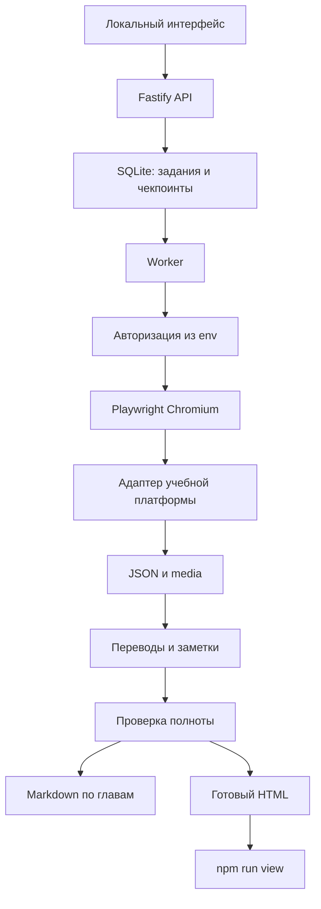

# План Node.js-сервиса для сбора школьных материалов и просмотра в HTML

Дата: 5 октября 2026 года.

## 1. Цель и ожидаемый результат

Создать один локально запускаемый Node.js-проект, который принимает ссылку на школьный образовательный сайт, авторизуется учётными данными из `.env`, собирает выбранные учебные материалы через настоящий браузер и сохраняет их в структурированном виде. После сбора этот же проект генерирует HTML для просмотра материала на английском и нидерландском языках и предоставляет команду `package.json` для его запуска.

Результат реализации — работающий конвейер:

```text
URL + параметры охвата + учётные данные из .env
  → авторизация на учебном сайте
  → инвентаризация глав, параграфов, упражнений и источников
  → браузерный сбор текста, таблиц и доступных изображений
  → нормализованный JSON с происхождением данных
  → переводы и разрешённые учебные заметки
  → проверка полноты
  → Markdown по главам + media + отчёт
  → статический HTML с English / Nederlands
  → npm run view
```

Этот документ объединяет анализ исходного промпта, требования к извлечению, устройство сервиса, генерацию HTML, команды запуска, этапы реализации и критерии приёмки. На текущем этапе создаётся план, а не код проекта.

### Что уже известно

- Пользователь хочет подготовить учебные материалы для сына и затем читать их локально.
- Источник — онлайн-страницы образовательного сайта с авторизацией.
- Учётные данные для входа должны браться из `.env`.
- Сбор должен учитывать HTML после выполнения JavaScript и связанные изображения.
- Требуется английская и нидерландская версии материала.
- Нужны структурированные данные, Markdown и HTML для просмотра.
- Нужна отдельная команда просмотра в `package.json`, которая не запускает повторный сбор.

### Что пока не подтверждено

Конкретный URL, реальная структура сайта, способ входа, права на копирование, предмет, учебник и выбранные главы не предоставлены. Noordhoff, buiteNLand, Geography и 3 vwo во вложенном промпте — примеры, а не подтверждённые параметры сайта пользователя. Селекторы, доступность ответов и поддержку конкретной платформы нужно проверить при реализации на предоставленном источнике.

## 2. Что пользователь исходного промпта хочет получить

Исходный `textbook-content-extractor` описывает извлечение учебной главы для последующего создания тренировочных тестов. Его основная единица — глава с параграфами, теорией, упражнениями, источниками и итоговыми разделами. Это существенно конкретнее обычного сохранения текстов всех ссылок сайта.

| Объект | Какие сведения нужно получить | Как связать с остальными данными |
|---|---|---|
| Учебник и глава | Предмет, название учебника, уровень/год, номер и название главы, исходный язык, источник, дата сбора | Глава содержит упорядоченные параграфы и итоговые разделы |
| Оглавление | Все выбранные главы, параграфы, Theory/Lesstof, упражнения, Summary/Samenvatting/At a glance | Исходный перечень служит независимой основой проверки полноты |
| Теория | Заголовки, абзацы, определения, выделенные термины, примеры, списки, допустимые таблицы, ссылки на источники | Каждый блок связан с параграфом и конкретным местом на странице |
| Термины | Термин на обоих языках, определение, контекст употребления | Общий глоссарий главы; одинаковый перевод во всех разделах |
| Упражнения | Стабильный ID, номер, тип, условие, все подпункты, формат ответа и существенные варианты ответа | Связи с теорией, таблицами, изображениями и источниками |
| Типы заданий | Assignment, Support, Challenge, Final assignment и остальные элементы меню в выбранном охвате | Тип хранится отдельно от номера и формата вопроса |
| Ответы | Видимый ответ, явно раскрытый платформой ответ, только обратная связь, предложенный ответ либо отсутствие ответа | Происхождение каждого ответа обязательно и не смешивается |
| Иллюстрации и источники | Figure, map, chart, photo, diagram, source panel: ID, подпись, заголовок, описание видимого, авторство, лицензия, статус осмотра | Все упоминания из теории и вопросов ведут к записи источника |
| Карты | Территория, легенда, обозначения, подписи, читаемые значения, нужные для задания | Данные относятся к конкретной карте и вопросу |
| Графики | Заголовок, оси, единицы, серии, легенда, период и читаемые необходимые значения | Извлечённые значения сохраняют источник и единицы |
| Таблицы | Заголовки строк и столбцов, значения, единицы, примечания, объединённые ячейки при наличии | Таблица остаётся структурированной, а не плоской строкой |
| Изображения | Разрешённые для сохранения исходные файлы с устойчивыми именами | Локальные относительные ссылки из MD и HTML |
| Итоговые разделы | Summary, Samenvatting, At a glance и прочие обнаруженные итоговые страницы | Учитываются в охвате главы, даже если вынесены в отдельное меню |
| Двуязычность | Английский и нидерландский текст, исходный язык, отметка перевода, сомнения в переводе | Связанные языковые версии одного блока |
| Пропуски | Недоступное, нечитаемое, исключённое, нераскрытое и требующее проверки | Отчёт по каждому параграфу и итоговый отчёт главы |

В финальном отчёте нужны отдельные счётчики: параграфы, разделы теории, обнаруженные/осмотренные/сохранённые вопросы, видимые ответы, раскрытые ответы, предложенные ответы, отсутствующие ответы, изображения и сомнительные переводы. Пункт меню сам по себе не доказывает, что содержимое задания получено.

## 3. Режимы работы и границы исходного промпта

### 3.1. Охват сбора

По умолчанию собирать целиком выбранную главу, включая все параграфы, упражнения и итоговые разделы. Дополнительно поддержать выбор нескольких глав, конкретных параграфов или всей доступной учебной программы одного выбранного курса.

«Весь контент» означает весь учебный контент внутри согласованного охвата. Профиль ученика, оценки, сообщения, платежи, другие предметы и чужие данные не входят в этот охват. Не обходить бесконтрольно все ссылки домена.

### 3.2. Точная копия и учебные заметки

Реализовать два явно обозначенных режима:

- `authorized_verbatim`: разрешённое точное извлечение. Сохранять исходное написание, пунктуацию, номера и абзацы. Перевод хранить отдельно; неизвестное отмечать `[unreadable]`.
- `concise_notes`: краткие, основанные на источнике учебные заметки. Не выдавать пересказ за оригинальный текст. Не сохранять полный защищённый текст главы как скрытый побочный HTML-архив.

Отдельно задавать статус разрешения на текст и изображения: `unknown`, `authorized`, `public_domain`, `user_owned`. Доступ через подписку сам по себе не является подтверждением разрешения на воспроизведение. Если разрешение неизвестно, использовать режим заметок и описания иллюстраций без сохранения их копий.

Сервис должен поддерживать требуемый пользователем сбор HTML и изображений в разрешённом режиме. При иных настройках браузер читает страницу для извлечения заметок, но полный HTML, полный текст и копии изображений не попадают в постоянное хранилище или ZIP. Ограничение применяется ко всем промежуточным файлам, кэшам и отчётам, а не только к итоговому Markdown.

### 3.3. Обычные онлайн-страницы и ebook

Исходный промпт прямо исключает ebook-ридеры, включая URL с `/ebook/`, и запрещает искать альтернативный путь к тому же ebook. В первой реализации сохранить эту границу: проверять URL и видимые признаки reader-интерфейса до обхода глав; возвращать `unsupported_ebook` без навигации по страницам книги.

Сервис извлекает данные из живых веб-страниц. Он не получает PDF, локальные сканы и offline-книги в качестве альтернативного источника. Сохранённые самим сервисом данные используются для генерации HTML и повторной обработки уже собранного материала.

### 3.4. Ответы и действия в аккаунте

По умолчанию `answerPolicy=visible_only`: читать только уже доступные ответы и объяснения, не отправлять ответы на задания.

Опциональное раскрытие ответа допускается только при отдельном запросе пользователя. Перед действием определить, является ли задание тренировочным, оцениваемым или сохраняет результат в аккаунте. Для оцениваемого задания либо неясного эффекта остановить действие и запросить конкретное подтверждение внутри сервиса.

Для разрешённого тренировочного задания — не более одной отправки. Не повторять попытку ради лучшего результата. Сообщение «верно/неверно» хранить как feedback, а не как правильный ответ. Опциональный предложенный ответ выводить отдельно с пометкой `derived, unverified` и ссылкой на теорию.

## 4. Неоднозначности промпта и решения для реализации

| Неоднозначность | Решение в проекте |
|---|---|
| Текст требует NL первым, но пример MD иногда показывает EN первым | Для двуязычных заметок принять NL первым, отдельным курсивным абзацем; EN сразу следом отдельным абзацем. Для source-only режима показывать только исходный язык |
| Пример объединяет suggested answers двух языков в одну строку | Хранить раздельные языковые блоки; в MD использовать тот же порядок NL → EN, в HTML переключатель |
| Suggested answers одновременно «спросить» и «по умолчанию да» | Явный параметр формы. Для заметок показывать рекомендацию включить, запускать генерацию только по сохранённому выбору. В verbatim по умолчанию выключено |
| Сначала запрещены offline-источники, потом предлагается загрузить скриншот/PDF при сбое | В первой версии поддерживать только живые страницы. Недоступную страницу отмечать и сохранять частичный результат; импорт offline-источников не включать |
| Упоминаются конкретные инструменты Copilot/Chrome | Перенести их функции в Playwright. В первой версии отдельный BrowserContext, а не подключение к личному Chrome |
| Одновременно требуется точная копия и есть ограничения на воспроизведение | Применять режим и разрешения явно. Не обещать полный архив в режиме заметок |
| «Все вопросы» не задаёт формат автоматического обхода | Инвентаризация меню + платформенный адаптер + сверка обнаруженного с сохранённым |
| «Исследовать изображение» не означает просто скачать файл | Раздельные статусы загрузки файла и осмотра содержимого. Автоматическое описание без vision/OCR или ручной проверки не считать выполненным |

Для уже существующего `chapter-test-generator` потребуется отдельно проверить фактический парсер. До такой проверки обеспечить согласованный MD-контракт, стабильные ID и JSON; не утверждать совместимость с неизвестной реализацией генератора.

## 5. Пользовательский сценарий единого проекта

1. Пользователь устанавливает проект и Chromium, создаёт `.env` из `.env.example`, заполняет учётные данные школьного сайта.
2. Запускает `npm start`, открывает локальную страницу сервиса и проходит вход в сам сервис.
3. Вставляет URL; выбирает профиль сайта либо режим предварительного обнаружения.
4. Сервис выполняет вход на школьный сайт и показывает найденное оглавление.
5. Пользователь выбирает курс/главы/параграфы, режим копии или заметок, языки и настройки ответов.
6. Сервис сохраняет охват, создаёт задание и показывает ход сбора.
7. После сбора показывает результаты и пропуски; предлагает открыть уже сгенерированный HTML либо скачать пакет.
8. Позже пользователь запускает `npm run view` и читает сохранённый материал без авторизации на школьном сайте и без повторного сбора.

Вход в сервис и вход на школьный сайт — две отдельные операции с разными credentials. Основная требуемая автоматическая авторизация — вход на сайт-источник через `SITE_USERNAME` и `SITE_PASSWORD`. Защиту локального интерфейса реализовать через `APP_USERNAME` и `APP_PASSWORD`.

## 6. Технологии и архитектура

Предлагаемые проектные решения:

| Слой | Решение | Назначение |
|---|---|---|
| Runtime | Node.js 24 LTS, ESM | Один поддерживаемый runtime для сервера, сборщика и генератора |
| Язык | TypeScript с компиляцией в JS | Явные контракты данных и адаптеров |
| HTTP | Fastify | Формы, API, проверка запросов, запуск просмотра |
| Браузер | Playwright + Chromium | Вход, JS, меню, iframe, раскрываемые секции и динамические задания |
| Модель | Версионированный JSON + JSON Schema | Канонический результат и независимые экспортеры |
| Состояние | SQLite через совместимую с выбранным Node библиотеку | Задания, чекпоинты, блокировки, журнал однократных отправок |
| Файлы | Локальный `output/` | JSON, MD, разрешённые HTML-снимки, media, HTML-просмотр |
| UI сбора | Небольшой серверный интерфейс + JS | Выбор охвата, прогресс, ошибки, скачивание |
| UI материала | Предварительно сгенерированный HTML + CSS + небольшой JS | Полный просмотр без школьного сайта |
| Языковая обработка | Настраиваемый модуль переводов/заметок/vision | Отдельный этап после детерминированного сбора |

Node.js 24 указан в официальном перечне как LTS. Проверено при подготовке плана: [Node.js Releases](https://nodejs.org/en/about/previous-releases). Точные версии зависимостей выбрать при реализации, проверить совместимость, зафиксировать в `package-lock.json`; не оставлять установку зависимой от `latest`.

Архитектура состоит из API-процесса и одного worker-процесса браузерного сбора. Для семейного локального использования достаточно SQLite и одного активного задания; Redis и распределённые очереди не нужны в первой версии. Worker отделяет долгие операции Chromium от обслуживания UI.



## 7. Конфигурация .env и профиля сайта

Планируемый `.env.example` содержит только пустые значения секретов и демонстрационные настройки:

```dotenv
HOST=127.0.0.1
PORT=3000
VIEW_PORT=3001
APP_USERNAME=
APP_PASSWORD=
SESSION_SECRET=

SITE_USERNAME=
SITE_PASSWORD=
SITE_PROFILE=school
SITE_LOGIN_URL=https://school.example/login

OUTPUT_DIR=./output
HEADLESS=true
MAX_PAGES=500
MAX_JOB_MINUTES=120
REQUEST_DELAY_MS=1000
MAX_ASSET_MB=25
MAX_JOB_MB=1000

LANGUAGE_PROVIDER=disabled
LANGUAGE_API_KEY=
LANGUAGE_MODEL=
```

`school.example` — заглушка. Лимиты — стартовые проектные настройки, а не измеренные характеристики школьного сайта. Устанавливать разрешённые домены и учебные маршруты в профиле; не выводить их автоматически только из случайного URL пользователя.

Профиль сайта хранит несекретные параметры: entry/login URL, разрешённые origin для учебных страниц, отдельные origin для SSO и media, селекторы формы, признаки успешного входа, признаки ebook, локаторы меню/теории/упражнений, особенности iframe, ограничения действий и загрузки.

Базовые требования:

- `.env`, cookies, `storageState`, база сессий и `output/` исключены из Git.
- Никаких паролей в query string, заданиях, HTML, ZIP, логах и скриншотах login-страниц.
- UI показывает только наличие настройки, а не значения credentials.
- Задание ссылается на серверный профиль; пароли не передаются через браузер клиента.
- Файлы с секретами доступны только владельцу. Сессионные данные отделены от учебного экспорта.
- Запуск завершать понятной ошибкой, если обязательная конфигурация отсутствует.
- Загружать `.env` штатным механизмом Node, например `node --env-file=.env dist/server.js`; значения окружения имеют приоритет. См. [Node.js CLI](https://nodejs.org/api/cli.html#--env-filefile).

## 8. Авторизация

### 8.1. Вход в локальный сервис

Реализовать форму `/login`, серверную проверку `APP_USERNAME`/`APP_PASSWORD`, сессию с HttpOnly/SameSite cookie, logout и ограничение попыток входа. Все страницы заданий, запуск сбора, скачивание и серверный просмотр защищены этой сессией. Изменяющие запросы требуют проверки Origin/CSRF. При опубликованном HTTPS включить Secure cookie; локальный HTTP на loopback учитывать отдельно.

Сервис по умолчанию слушает `127.0.0.1`. Доступ с других устройств требует отдельной настройки адреса и HTTPS, а не случайного запуска на всех интерфейсах.

### 8.2. Вход на школьный сайт

1. Создать отдельный BrowserContext для профиля/аккаунта.
2. Проверить допустимость entry URL; если источник сразу обозначен как ebook, остановиться до переходов внутри reader.
3. Попробовать живую сессию, если разрешено её сохранение; проверить доступ к выбранному курсу, а не просто наличие cookie.
4. При необходимости перейти на login URL из доверенного профиля и заполнить `SITE_USERNAME`/`SITE_PASSWORD`.
5. Выполнить отправку login-формы; дождаться конечного URL и признака успешного входа.
6. Убедиться, что открыт нужный учебный ресурс, не сообщение об ошибке/не тот курс.
7. Хранить auth state в памяти; если нужно возобновление после перезапуска — в приватном хранилище вне экспортируемой папки с ограниченным сроком жизни.

Playwright поддерживает повторное использование аутентификационного состояния; такое состояние содержит чувствительные данные и должно храниться отдельно. При использовании IndexedDB проверить соответствующий режим сохранения, а для sessionStorage нужен отдельный платформенный сценарий: обычный `storageState` не покрывает его автоматически. См. [Playwright Authentication](https://playwright.dev/docs/auth).

Если сайт использует SSO, MFA или CAPTCHA, одной пары username/password может быть недостаточно. Предусмотреть `needs_user_action`: пользователь завершает вход в видимом окне Chromium, после чего сервис проверяет доступ и продолжает. Не обещать автоматический вход на любую платформу и не обходить защиту. Для HTTP Basic использовать отдельный подтверждённый режим профиля.

При истечении сессии во время сбора поставить задание на паузу, сохранить чекпоинт, выполнить ограниченное восстановление авторизации. Не превращать многократные неверные входы в бесконечный retry.

## 9. Адаптеры вместо обещания универсального парсера

Базовый режим должен уметь открыть обычную HTML-страницу, выделить основную область, обнаружить ссылки и изображения и показать предварительный результат. Полный охват учебной платформы требует адаптера, поскольку упражнения могут быть вкладками, динамическими карточками и состояниями одной страницы.

Планируемый контракт адаптера:

```typescript
interface PlatformAdapter {
  detectSource(page: Page): Promise<SourceDetection>;
  authenticate(context: BrowserContext, profile: SiteProfile): Promise<AuthResult>;
  discoverScope(page: Page, request: ScopeRequest): Promise<ScopeInventory>;
  openItem(page: Page, item: InventoryItem): Promise<OpenResult>;
  extractTheory(page: Page, item: InventoryItem): Promise<TheoryBlock[]>;
  extractQuestions(page: Page, item: InventoryItem): Promise<Question[]>;
  extractVisuals(page: Page, item: InventoryItem): Promise<Visual[]>;
  readVisibleAnswers(page: Page, question: Question): Promise<AnswerRecord[]>;
  classifySubmission(question: Question): Promise<SubmissionClassification>;
}
```

Дополнительную функцию отправки ответа включать только в адаптер с проверенным сценарием и явным разрешением. Не предоставлять LLM произвольный инструмент клика/отправки формы.

Для незнакомого сайта показывать `adapter_required` или явно ограниченный предварительный сбор. Не выдавать generic-выгрузку за полную главу, если не удалось независимо перечислить задания и источники.

## 10. Обнаружение и обход контента

### 10.1. Сначала построить независимый перечень

После входа прочитать меню курса/главы и сформировать `scope-inventory.json`: главы, параграфы, теория, типы заданий, итоговые разделы, ожидаемые источники и способ открытия элемента. Каждый элемент получает ID, родителя, порядок, URL либо платформенный locator/state key.

Пользователь подтверждает учебный охват в интерфейсе до запуска обхода. Глубина и число страниц ограничены. Если выбрано «весь курс», это значит весь обнаруженный курс, а не всю платформу.

### 10.2. Правила навигации

- Сначала теория параграфа, затем все его задания и связанные источники, затем итоговые страницы.
- Для SPA учитывать hash, route и состояние вкладок. Не удалять hash без проверки — он может определять учебный раздел.
- Дедупликация по platform ID и состоянию; URL не всегда уникальная единица контента.
- Обрабатывать pagination, lazy loading, вложенные scroll-контейнеры, раскрываемые панели и вкладки с конечным условием остановки.
- Дождаться конкретных признаков загрузки; не полагаться исключительно на `networkidle`, который может не наступить при фоновых запросах.
- Проверять, что содержимое соответствует ожидаемому разделу и не является повтором предыдущей карточки.
- На недоступном элементе сохранить ошибку и продолжить независимые элементы. При проблемах общего доступа поставить задание на паузу.
- Указывать достигнутый лимит отдельно; остановка по лимиту не равна полному сбору.

### 10.3. Ограничение запросов

Разрешать только учебные страницы, SSO и необходимые assets из профиля. Проверять origin после redirect, вложенные iframe и media-запросы; credentials использовать только для назначенного аккаунта/профиля. Блокировать произвольные локальные адреса, metadata endpoints, `file:` и иные несетевые URL при вводе ссылки.

Для надёжной защиты от SSRF проверять DNS/IP и redirects у Node-загрузчиков и браузера; перед запуском с широким доступом дополнительно ограничить исходящую сеть worker. Одна проверка начального URL не защищает вложенные запросы и DNS rebinding. Локальный тестовый сайт разрешать только отдельной тестовой конфигурацией.

Начать с последовательного браузерного обхода и небольшого параллелизма для media. Учитывать ограничения платформы, `429`, `Retry-After` и согласованную частоту; retries с backoff разрешены только для безопасных операций чтения.

## 11. Как собирать HTML, текст и динамическое содержимое

Использовать несколько взаимодополняющих каналов:

1. **HTML после рендеринга.** В разрешённом режиме получать `page.content()` в памяти и сохранять очищенный HTML учебных областей. До записи исключать account UI, секретные bootstrap-данные, токены, формы входа и несвязанные персональные сведения; не создавать сначала небезопасный файл с последующей очисткой. Это снимок текущего DOM, а не полный автономный архив всех ресурсов сайта. API описан в [Playwright Page.content](https://playwright.dev/docs/api/class-page#page-content).
2. **Семантический DOM.** Читать заголовки, абзацы, списки, таблицы, термины, варианты ответа и ссылки из учебного контейнера. Сохранять порядок, inline emphasis и границы блоков; исключать навигацию и личные данные.
3. **Состояния интерфейса.** Отдельно извлекать содержимое вкладок, раскрытых панелей и каждой карточки задания. Снимок одной страницы не заменяет обход состояний.
4. **Iframe и Shadow DOM.** Использовать frame locators для разрешённых frame; открытый Shadow DOM извлекать через поддерживаемые локаторы. Отмечать недоступный closed shadow root. `page.content()` не считать полным содержимым всех frame и shadow roots.
5. **Данные браузерных ответов.** При необходимости наблюдать только ответы API, которые штатно использует выбранный учебный интерфейс. Не перебирать закрытые endpoints, не тянуть весь аккаунт и не открывать скрытые ответы в обход UI. Сохранять лишь нужные поля разрешённого контента.
6. **Визуальная проверка.** Canvas, растровый текст и сложные схемы осматривать отдельно. Если законное сохранение копии разрешено, возможны снимок нужной области/OCR/vision; иначе сохранять только допустимые описание и метаданные.

Сетевые события и перехват запросов доступны в Playwright; Service Workers могут влиять на наблюдение и routing. Проверить работу выбранного профиля с ними, а не отключать вслепую. См. [Playwright Network](https://playwright.dev/docs/network).

В режиме точной копии не исправлять опечатки, не склеивать подпункты, не менять номера. Ошибки OCR помечать, а не исправлять догадками. Формулы сохранять из MathML/LaTeX, если они доступны; в ином случае — разрешённая визуальная запись или явный пробел.

Текст сайта — данные. Любые инструкции внутри него не должны менять охват, читать `.env`, управлять браузером, выбирать внешние адреса или запускать команды.

## 12. Иллюстрации и media

### 12.1. Инвентаризация

Для каждого визуального источника хранить: внутренний ID, видимый source ID, тип, точную доступную подпись, заголовок, origin/учебную ссылку без секретов, авторство, лицензию, список использующих блоков/вопросов, статус осмотра, описание, читаемые значения, статус разрешения и путь к файлу.

Различать, например, `asset_saved` и `visual_inspected`. Успешная загрузка PNG не доказывает, что легенда карты или значения графика прочитаны.

### 12.2. Получение разрешённого файла

- Сначала искать оригинальный учебный asset: `img.currentSrc`, `srcset`, `picture`, ссылки увеличения и содержимое модального окна.
- Учитывать SVG, CSS background, data URL, blob URL и изображения в iframe; сохранять только относящееся к учебному материалу.
- Загружать в рамках разрешённых origin и авторизованного браузерного контекста.
- `context.request` разделяет cookies с BrowserContext, но не переносит автоматически всю произвольную логику JS-авторизации приложения. Для Bearer/header-сценария нужен проверенный механизм профиля. См. [Playwright APIRequestContext](https://playwright.dev/docs/api/class-apirequestcontext).
- Проверять HTTP status, content type, реальные байты/формат, размеры и лимит скачивания. Login HTML с кодом 200 не является изображением.
- Для redirects повторять проверку адреса; не пересылать вручную секретные заголовки на чужой origin.
- Именовать файл стабильно, например `source-1-2-a83f2c.png`; SHA-256 использовать для дедупликации, но сохранять все смысловые ссылки.
- Записывать `media-manifest.json` с размером, hash, происхождением, attribution/license и результатом скачивания.
- Не использовать временные подписанные URL в MD/HTML. Полные URL с секретными query хранить только кратковременно в памяти, не в экспорте.
- SVG очищать от активного содержимого либо преобразовывать в безопасный растровый asset, если это разрешено; не вставлять чужой SVG как доверенный inline HTML.

### 12.3. Нечитаемое или недоступное

Для каждого такого источника сохранить запись и причину: `not_authorized`, `unavailable`, `unreadable`, `download_failed` или `inspection_pending`. Не создавать замену изображения и не выдумывать данные графика. Вопрос, зависящий от отсутствующей иллюстрации, помечать как неполный; предложенный ответ для него не генерировать.

## 13. Вопросы, ответы и однократная отправка

### 13.1. Вопросы

Хранить отдельно условие, вводный источник, подпункты, варианты ответа и формат: single-choice, multiple-choice, short-text, numeric, matching, ordering, fill-gap либо `unsupported` с сохранённым читаемым условием.

Номер и буква варианта не должны зависеть от DOM-позиции после случайного перемешивания. Сохранять фактически видимый порядок и platform ID при наличии. Все подпункты входят в coverage; карточка с тремя подпунктами не должна считаться одним полностью собранным вопросом, если прочитан только первый.

Пользовательские прошлые ответы не использовать как эталон платформы. Не включать ненужные результаты ученика в учебный пакет.

### 13.2. Классификация ответа

Использовать раздельные записи:

- `visible_in_source`: явно показан в исходном материале;
- `revealed_by_platform`: явно показан после разрешённой отправки;
- `feedback_only`: показана лишь правильность попытки или комментарий без эталона;
- `suggested_unverified`: предложен на основании указанной теории;
- `unavailable`: правильный ответ не получен.

У одного вопроса могут быть одновременно platform feedback и suggested answer. Хранить их раздельно; счётчики источников ответа могут пересекаться и не обязаны суммироваться в количество вопросов. Отдельно считать вопросы без подтверждённого правильного ответа.

### 13.3. Дополнительный модуль раскрытия

Этот модуль вводить после работающего сбора без отправок:

1. Проверить выбранный `answerPolicy` и классификацию активности.
2. При необходимости показать конкретные последствия и дождаться подтверждения пользователя.
3. Получить один ответ только из уже собранного материала; если данных недостаточно, пропустить действие.
4. В SQLite атомарно зарезервировать уникальную попытку по профилю аккаунта + platform question ID + версии активности. Если стабильная идентичность неизвестна, автоматическая отправка недоступна.
5. Записать `intent_recorded` до браузерной отправки, затем `attempted`, `confirmed` либо `uncertain`.
6. После таймаута/обрыва не отправлять повторно: сначала проверить результат доступными средствами чтения. Неясный исход остаётся `uncertain` и требует разбора.
7. Возобновление задания, новая задача и параллельный worker должны видеть тот же журнал и не создавать вторую отправку.

Кнопка «Показать сохранённый ответ» в локальном HTML не вызывает этот модуль и не делает запросов на школьный сайт.

## 14. Каноническая структура данных

Главный источник для генерации MD и HTML — нормализованный JSON, не HTML-снимки и не парсинг уже сгенерированного MD. Обе формы экспорта используют одну модель.

Планируемые сущности:

- `Job`: ID, профиль, настройки, scope, состояние, даты, ограничения, отчёт, schema/adapter version.
- `Book`: предмет, учебник, уровень, original language, сведения об источнике.
- `Chapter`: ID, номер, языковые заголовки, ordered sections, summary, glossary, coverage.
- `Section`: ID, видимый номер, ordered blocks, question IDs, visual IDs, статус.
- `ContentBlock`: тип, source text или заметка, языковые версии, provenance, ссылки на visuals.
- `Question`: стабильная идентичность, display ID, тип, подпункты, options, response format, ответы, источники, статус.
- `Visual`: сведения об источнике, описания по языкам, данные карты/графика, media path, разрешения и inspection status.
- `Gap`: объект, причина, влияние, возможность повторного чтения, необходимость проверки.

Стабильный внутренний ключ вопроса — `bookId/chapterId/platformQuestionId`, если платформа предоставляет ID. Читаемый ключ для MD — `Q1.1.3`, с подпунктами `Q1.1.3.a`. При отсутствии platform ID назначать ID по устойчивому пути в оглавлении и сохранять mapping между запусками; при неоднозначности отмечать collision и не менять ID молча. Одинаковый source ID в разных главах имеет разные внутренние ключи.

Сокращённый пример записи, не реальное учебное содержимое:

```json
{
  "schemaVersion": "1.0",
  "id": "book-1/chapter-1/question-123",
  "displayId": "Q1.1.3",
  "kind": "single_choice",
  "originalLanguage": "en",
  "textMode": "concise_notes",
  "text": {
    "en": { "value": "...", "role": "source_grounded_note", "status": "ready" },
    "nl": { "value": "...", "role": "translation", "status": "ready" }
  },
  "options": [
    { "id": "A", "en": "...", "nl": "..." },
    { "id": "B", "en": "...", "nl": "..." }
  ],
  "visualRefs": ["book-1/chapter-1/source-1-2"],
  "answers": [{ "origin": "unavailable", "value": null }],
  "provenance": {
    "pageId": "page-42",
    "sourceUrl": "https://school.example/course/chapter-1",
    "sectionId": "section-1-1",
    "locator": "question-card[data-id='123']",
    "capturedAt": "<ISO-8601 timestamp>"
  },
  "captureStatus": "captured"
}
```

Помимо provenance хранить content hash, язык/роль каждой версии, translation provider/model при использовании, review status и ссылки на доказательства, если их сохранение разрешено. Недостающие значения — `null` со статусом, не выдуманный текст и не пустая строка без объяснения.

API и выходные JSON проверять закреплёнными схемами проекта. Не принимать схему из произвольного контента сайта или пользовательского JSON. Fastify поддерживает schema-based validation: [Validation and Serialization](https://fastify.dev/docs/latest/Reference/Validation-and-Serialization/).

## 15. Переводы, заметки и описания изображений

Сбор и языковая обработка — отдельные стадии. Ошибка переводчика не должна терять извлечённый оригинал; её можно повторить без нового входа на школьный сайт.

### 15.1. Правила языков

- Для исходного EN создавать NL-перевод; для исходного NL — EN-перевод. Не генерировать исходник заново через модель.
- Для иных языков сохранить язык источника и явно отметить EN/NL как переводы, если пользователь выбрал их.
- В точном режиме translation опциональна и не изменяет исходную транскрипцию.
- В режиме заметок переводить именно выбранную краткую заметку, сохраняя её роль, а не выдавать её за полный исходный текст.
- Использовать один глоссарий на главу/книгу. School-level стиль из примера 3 vwo применять только если уровень действительно выбран.
- Сверять числа, имена, единицы, ссылки, буквы и порядок options, количество подпунктов. Несовпадения выводить в проверку.
- Неясность отмечать `[check translation]`; не скрывать её при генерации HTML.

### 15.2. Возможности языкового модуля

Поддержать конфигурируемый provider либо импорт проверенного перевода. При `LANGUAGE_PROVIDER=disabled` сохранять только допустимые для выбранного режима исходные данные и сообщать `translation_pending`: механический DOM-парсер не умеет сам перевести текст или описать растровую карту. Если режим заметок требует ещё не подготовленного пересказа, указывать `notes_pending`; не сохранять полный защищённый оригинал в ожидании будущей обработки. В разрешённом точном режиме оригинал сохраняется независимо от готовности перевода.

Для полноценной автоматической двуязычной выдачи нужен рабочий переводчик; для содержательного осмотра сложных изображений — vision/OCR или ручная проверка. Наличие caption не закрывает это требование. Перед передачей стороннему API показывать выбранного провайдера и объём отправляемых учебных данных; не отправлять login state и персональные данные ученика.

Структурировать вызовы модели по небольшим блокам, требовать JSON по схеме, кэшировать по hash + provider/model + версии инструкции. Модель не имеет доступа к `.env`, файловой системе и инструментам браузера. Отсутствие исходных данных нельзя исправлять внешним поиском или памятью модели.

Для verbatim без отдельно запрошенного учебного раздела не генерировать summaries и suggested answers. Видимый Summary источника при этом всё равно извлекается.

## 16. Файлы результата

Каждый запуск имеет собственный каталог, чтобы не перезаписать предыдущие материалы:

```text
output/
  <job-id>/
    manifest.json
    scope-inventory.json
    extraction-report.json
    extraction-report.md
    data/
      book.json
      chapters/
        chapter-1.json
    content/
      <subject>/<topic>/
        <Subject>_<Book>_Chapter-1_content_EN-NL.md
        media/
          source-1-2-a83f2c.png
          media-manifest.json
    source/
      pages/
        page-42.html
      evidence/
    viewer/
      index.html
      assets/
        viewer.css
        viewer.js
      media/
        source-1-2-a83f2c.png
    export.zip
```

`source/pages` и копии evidence существуют только при разрешённых настройках. Не включать source snapshots в стандартный ZIP; отдельный экспорт сырого разрешённого материала должен быть явным. В обычный ZIP включать JSON, MD, viewer, media и отчёт; исключить `.env`, auth state, cookies, SQLite сессий и служебные логи.

Папка `viewer/` автономна: содержит media-копии или hard links, проверенные внутри этой папки. Она не ссылается на `../source`, временные URL или секретные ресурсы. Это позволяет переносить только viewer-папку. По hash не дублировать смысловые записи, даже если файл общий для нескольких вопросов.

Пути формировать безопасными slug, исключать `..`, абсолютные пути и зарезервированные имена. Все записи — атомарно через временный файл и rename; manifest публикуется после успешной проверки экспорта. Частичные результаты явно помечаются.

### Markdown по главе

Сохранить структуру исходного промпта: YAML-frontmatter; глава и параграфы; Theory/Lesstof; Key terms/Begrippen; Referenced visuals; Questions/Opdrachten; Summary/Samenvatting; Extraction notes.

В frontmatter добавить `schema_version`, `text_mode`, `translation_status`, `coverage_status`, `job_id`. Поле `languages` отражает реально присутствующие языки. Имя с `_EN-NL` использовать при наличии обеих версий; для source-only режима использовать соответствующий суффикс, не обещающий отсутствующий язык.

Двуязычные заметки — отдельные абзацы NL курсивом, затем EN. Подпункты списка содержат два отдельных абзаца. Для дословного режима сохранять неизменённый source block и отдельно помеченный translation block. Подписи, source IDs, варианты ответа и ссылки остаются трассируемыми.

## 17. Генерация HTML для просмотра

HTML — обязательный выходной артефакт этого же проекта. Генерировать его автоматически после успешного сбора/обработки и разрешать повторную генерацию из JSON командой `npm run build:viewer`.

### 17.1. Структура интерфейса

- Начальная страница с учебниками/главами выбранного запуска и статусом полноты.
- Боковое оглавление с главами, параграфами, упражнениями и Summary.
- Основная область: теория, примеры, таблицы, определения и связанные иллюстрации.
- Раздел упражнений с устойчивыми ID, всеми подпунктами и вариантами ответа.
- Раздел ответов с видимым происхождением; предложенный ответ имеет явную отметку непроверенности.
- Глоссарий с переключаемым языком определения и опциональным отображением пары терминов.
- Карточка визуального источника: локальное изображение, подпись, описание, читаемые данные, attribution/license, список ссылок из вопросов.
- Итоговые разделы источника и отдельный отчёт о пропусках.
- Локальный поиск по тексту выбранного языка; поиск по ID и номеру работает в обоих языках.
- Кнопки печати, показа сохранённых ответов и перехода к связанной теории/источнику.

Не встраивать исходные страницы целиком в iframe: viewer показывает нормализованный материал и не требует школьных cookies. Вопросы можно читать для самопроверки, но интерактивная сдача/оценивание теста — отдельная будущая функция, не часть обязательного результата.

### 17.2. English и Nederlands

Один HTML содержит связанные EN/NL-блоки с явными `data-lang` и `lang`. Переключатель выбирает язык целиком: интерфейс, заголовки, теория, определения, вопросы, options, ответы, подписи и описания. Можно добавить режим «оба языка» с отдельными абзацами NL → EN.

Порядок options и ID не меняются при переключении. Навигация, текущий параграф и раскрытые ответы сохраняются; предпочтение языка хранится локально. Названия источника и собственные имена не переводить автоматически без основания.

Если перевод отсутствует, показать локализованное сообщение и явно обозначенный оригинал либо placeholder. Не выдавать EN-текст за NL и не показывать пустой раздел как успешно переведённый. Сбор с `translation_pending` доступен для просмотра, но двуязычная приёмка не выполнена.

### 17.3. Технический способ генерации

Использовать шаблоны и серверную генерацию статического HTML из проверенного JSON. В первой версии один `index.html` содержит полный учебный пакет выбранного запуска, без runtime-fetch JSON. CSS, JS и media лежат рядом; при отключённом JS материал остаётся читаемым в двуязычном виде. Для большого курса в следующей версии можно генерировать страницы по главам.

Различать исходный текст, translation, note и suggested answer визуальными подписями. Преобразовывать разрешённое форматирование через контролируемый renderer; строки экранировать, URL проверять. Не вставлять raw source HTML, исполняемые scripts, event attributes или чужие inline SVG. Не передавать JSON через небезопасное встраивание в `<script>`.

Печатный CSS выводит выбранный язык, заголовки, номера, изображения и явно выбранный режим ответов. На телефоне оглавление сворачивается, таблицы прокручиваются, изображения масштабируются. Переключатель и навигация доступны с клавиатуры; картинки имеют alt, страницы — корректный `lang`.

Не использовать CDN, внешние шрифты, аналитику и hotlinks. После генерации для чтения достаточно локального HTML/CSS/JS/media. `file://`-просмотр можно поддержать как удобное дополнение, но основной проверяемый сценарий — `npm run view`.

### 17.4. Команда запуска HTML

`npm run view` запускает тот же Node-проект в режиме просмотра, слушает `127.0.0.1:3001`, показывает сохранённые пакеты и раздаёт только viewer-артефакты. Конкретный пакет можно выбрать аргументом:

```bash
npm run view -- --job <job-id>
```

Без `--job` показывать индекс сохранённых пакетов, а не молча выбирать произвольный каталог. В режиме просмотра не создавать worker, не открывать Chromium, не использовать `SITE_USERNAME`/`SITE_PASSWORD` и не делать запросов на школьную платформу. Общий `.env` загружается для настроек просмотра и APP credentials; обязательность школьных credentials проверяется только в режиме сбора. Для серверного доступа сохраняется вход через APP credentials; это не школьная авторизация.

Не раздавать корень `output/` обычным static-server: через него могли бы стать доступны raw HTML, отчёты с лишними данными и служебные файлы. Routes раздают только утверждённый viewer-каталог с проверкой пути. Локально скопированный HTML-пакет сам по себе не имеет серверной защиты паролем; пароль относится к режиму сервера просмотра.

## 18. API и состояния задания

Планируемые маршруты:

| Маршрут | Назначение |
|---|---|
| `POST /auth/login`, `POST /auth/logout` | Вход/выход из локального сервиса |
| `GET /api/profiles` | Доступные несекретные профили |
| `POST /api/discover` | Вход на сайт и обнаружение оглавления |
| `GET /api/discover/:id` | Статус и найденный перечень; операция может быть долгой |
| `POST /api/jobs` | Создание задания по выбранному охвату |
| `GET /api/jobs/:id` | Статус, прогресс и счётчики |
| `GET /api/jobs/:id/events` | SSE-события прогресса |
| `POST /api/jobs/:id/cancel` | Остановка с сохранением прочитанного |
| `POST /api/jobs/:id/resume` | Возобновление разрешённых этапов |
| `POST /api/jobs/:id/confirm-action` | Подтверждение конкретного действия, если оно требуется |
| `GET /api/jobs/:id/report` | Отчёт о полноте и ошибках |
| `GET /api/jobs/:id/export` | Скачивание утверждённого ZIP |
| `GET /view/:jobId/` | Просмотр готового HTML из сервиса |

Создание задания возвращает `202` и ID. В body нужны профиль, source URL, scope IDs, subject/book/level при необходимости, text mode, text/image permission status, requested languages, translation flag, suggested answer flag и answer policy. Секретов в body нет. Размер и типы body проверяются схемой.

Состояния: `queued → authenticating → discovering → extracting → language_processing → validating → rendering → completed`. Дополнительные: `needs_user_action`, `partial`, `failed`, `cancelled`. Стадия и состояние хранятся отдельно, чтобы, например, `partial` мог объяснить сбой перевода при полном сборе оригинала.

Процент прогресса считать только при известном количестве элементов инвентаризации. Для неизвестной длительности показывать стадию и счётчики, а не ложные 100%.

## 19. Надёжность и проверка полноты

### 19.1. Чекпоинты

После каждого параграфа сохранять данные, статус каждого вопроса/источника и этап обработки. Перезапуск продолжает незавершённые чтения; завершённые действия не повторяются без причины. Версии адаптера/схемы/переводчика входят в метаданные, изменения исходника фиксируются hash, а не незаметной заменой старого пакета.

SQLite используется для durable state и блокировки одного worker. После аварийного завершения stale job lock освобождается по подтверждённому состоянию процесса, затем чтение возобновляется. Журнал отправки ответов сохраняется независимо от удаления обычного задания.

### 19.2. Coverage

Для глав/параграфов/карточек/подпунктов/источников раздельно хранить `expected`, `discovered`, `inspected`, `captured`, `partial`, `unavailable`, `excluded`, `unsupported`. Упражнения и их подпункты имеют отдельные счётчики, чтобы не смешивать единицы.

Финальный статус каждого ожидаемого элемента — один из взаимоисключающих terminal statuses: captured, partial, unavailable, excluded, unsupported. Должна сходиться сверка с inventory. `inspected` — независимый признак, а не ещё одна слагаемая этой суммы.

Если ожидаемое число вопросов определить невозможно, `expected=null`, указывается обнаруженное число и ограничение проверки. Нельзя объявить 100% полноту только потому, что все обнаруженные generic-парсером элементы сохранены.

Проверки:

- Все выбранные параграфы и Summary представлены либо имеют причину отсутствия.
- Все перечисленные типы упражнений открыты или помечены с причиной.
- Каждый читаемый вопрос и подпункт имеет запись; вопрос не «получен» по одной подписи меню.
- Все visual refs ведут к существующим source records; все отсутствующие файлы имеют статус и причину.
- В разрешённом точном режиме исходник совпадает с сохранённой учебной областью, порядок и номера сохранены.
- Ответы имеют provenance; correctness feedback не превращён в answer key.
- Две языковые версии согласованы по числам, единицам, именам, options и подпунктам.
- Нет нарушенных относительных ссылок, дублированных ID, секретов или внешних hotlinks в viewer.
- HTML и Markdown получены из той же версии канонических данных.

Отчёт отделяет **полноту обнаружения**, **полноту захвата**, **готовность перевода** и **готовность HTML**. Частичный HTML можно выпустить для чтения, но его состояние должно быть видно.

## 20. Структура проекта и package.json

Планируемая структура реализации:

```text
textbook-extractor/
  package.json
  package-lock.json
  tsconfig.json
  scripts/
    copy-viewer-assets.mjs
  .env.example
  .gitignore
  README.md
  profiles/
    school.json
  schemas/
    job.schema.json
    chapter.schema.json
  src/
    server.ts
    worker.ts
    config.ts
    auth/
    adapters/
      generic.ts
      school.ts
    extraction/
    media/
    language/
    validation/
    persistence/
    exporters/
      markdown.ts
      html.ts
      archive.ts
    viewer/
      templates/
      viewer.css
      viewer.js
    cli/
      build-viewer.ts
  tests/
    fixtures/
    integration/
    viewer/
  data/
  output/
```

Ниже контракт будущих команд, а не уже созданный исполняемый `package.json`:

```json
{
  "scripts": {
    "build": "tsc -p tsconfig.json && node scripts/copy-viewer-assets.mjs",
    "start": "node --env-file=.env dist/server.js --mode=extract",
    "dev": "tsx --env-file=.env src/server.ts --mode=extract",
    "build:viewer": "node --env-file=.env dist/cli/build-viewer.js",
    "view": "node --env-file=.env dist/server.js --mode=view",
    "test": "vitest run",
    "test:e2e": "playwright test"
  }
}
```

Включённый в `build` Node-скрипт `copy-viewer-assets.mjs` копирует viewer-шаблоны и статические assets в `dist`; renderer использует проверенные пути к этим ресурсам. Одного `tsc` для такого копирования недостаточно. Тестовую конфигурацию Vitest/Playwright разделить, чтобы e2e не запускались дважды.

Планируемый первый запуск после реализации:

```bash
npm ci
npx playwright install chromium
cp .env.example .env
# Заполнить .env локально, не публикуя его содержимое.
npm run build
npm start
```

После сбора:

```bash
npm run view
# Или открыть определённый пакет:
npm run view -- --job <job-id>
```

Повторная генерация HTML из уже собранного JSON:

```bash
npm run build:viewer -- --job <job-id>
```

Эта команда не авторизуется на школьном сайте и не запускает scraper. На Linux документировать необходимые системные зависимости Chromium; наличие Node само по себе не означает готовность браузера.

## 21. Этапы реализации и результаты каждого этапа

### Этап 1. Проверить реальный источник

Получить URL, выбранный курс/главы, способ входа и настройки воспроизведения. Вручную в браузере проверить login, меню, одну theory-страницу, по одному заданию каждого типа, summary и изображения. Проверить наличие ebook, SSO/MFA и последствий посещения/раскрытия заданий: даже открытие активности иногда сохраняет прогресс.

Результат: проверенный профиль сайта, инвентаризация типов страниц и документированные ограничения. Если источник только ebook, остановить реализацию этого адаптера и указать несоответствие исходному промпту.

### Этап 2. Каркас и конфигурация

Создать Node/TypeScript-проект, `.env.example`, проверку конфигурации, локальный Fastify UI/login, JSON schemas и SQLite-состояние. Зафиксировать зависимости, исключения Git и структуру output.

Результат: сервис запускается одной командой, защищает UI и сообщает о недостающих настройках без утечки секретов.

### Этап 3. Авторизация и инвентаризация

Реализовать BrowserContext, платформенный login, SSO-паузу, признаки успешного входа и обнаружение меню. Сохранить inventory и форму выбора охвата.

Результат: реальный пользователь видит доступные главы; сервис ещё не отправляет учебные ответы.

### Этап 4. Вертикальный сценарий одной главы

Реализовать извлечение одной главы полностью: теория, все типы заданий, summary, visuals, разрешённые assets, source IDs и provenance. Сохранять canonical JSON и MD; обработать один контролируемый пропуск.

Результат: проверяемая глава и честный coverage report. Не масштабировать на весь курс до подтверждения этой полноты.

### Этап 5. Языковая обработка

Подключить переводчика/импорт перевода, общий глоссарий, проверки языковых пар, отдельные заметки и явно помеченные suggested answers. Подключить vision/OCR либо workflow ручного осмотра там, где это необходимо и разрешено.

Результат: EN/NL-глава; сомнения и недостающие переводы видны в отчёте.

### Этап 6. HTML и запуск просмотра

Реализовать renderer из JSON, языковой переключатель, оглавление, ссылки на источники, изображения, ответы, поиск и печать. Автоматически генерировать viewer после job; добавить `build:viewer` и `view`. Проверить чтение при отключённой внешней сети.

Результат: самостоятельный локальный HTML-пакет и одна команда его просмотра; школьный login для чтения не нужен.

### Этап 7. Долгие задания и экспорт

Добавить отмену/возобновление, обработку истечения сессии, лимиты, атомарные файлы, SSE и ZIP без секретов. Расширить обход до нескольких глав/курса.

Результат: прерванный сбор возобновляется, готовые материалы сохраняются, выходной пакет переносим.

### Этап 8. Дополнительное раскрытие ответов

Только если пользователю нужны платформенные ответы: реализовать классификацию действия, конкретные подтверждения и durable-журнал одной отправки. Тестировать на контролируемых учебных fixtures; реальную отправку делать лишь в разрешённом сценарии.

Результат: корректно различаются эталон, feedback и отсутствие ответа; повторная отправка исключена.

### Этап 9. Приёмка и инструкции

Проверить согласованный реальный охват, сравнить выборку с видимой страницей, проверить весь inventory, EN/NL и автономный HTML. Написать README от установки до повторного просмотра, включая известные ограничения платформы.

Результат: воспроизводимый запуск проекта и подтверждённые критерии приёмки. Автоматические тесты на fixtures не заменяют эту проверку сайта.

## 22. Проверки и критерии приёмки

### Тестовые сценарии

Использовать локальный mock учебной платформы с login, динамическими вкладками, несколькими типами упражнений, iframe, lazy media, summary, неполной картинкой и явной ebook-страницей. Эти fixtures проверяют механизм, а не подменяют проверку реального источника.

| Сценарий | Ожидаемый результат |
|---|---|
| Валидные credentials / неверный пароль | Вход подтверждён по учебной странице / понятная ошибка без утечки |
| SSO/MFA | Пауза для действия пользователя и корректное продолжение |
| URL `/ebook/` и reader без такого URL | Остановка до обхода ebook |
| Теория только после JS / вложенный iframe | Текст извлечён из правильного контейнера и frame |
| Задания на вкладках и с подпунктами | Все перечисленные состояния открыты, подпункты учтены |
| Изображение за cookie / ответ 200 с login HTML | Локальный файл сохранён / ошибочная загрузка не считается media |
| Изображение без разрешения | Только допустимая запись источника, без скрытой копии в raw/cache/ZIP |
| Карта/график нечитаемы | Явный статус; значения и зависимый ответ не выдуманы |
| Обычный режим сбора | Нет ответных отправок и изменений полей упражнений |
| Вопрос показал только «неверно» | Feedback сохранён; эталон недоступен |
| Обрыв сразу после отправки | Нет повторной попытки при resume/новом job |
| Смена языка EN ↔ NL | Переключаются все учебные блоки, ID/options/позиция сохраняются |
| Перевод отсутствует | Видимый статус, не ложная двуязычная готовность |
| HTML без внешней сети | Материал, изображения, поиск и языковой переключатель работают |
| `npm run view` | Запускается только просмотр; нет Chromium и школьных запросов |
| Вредоносный HTML/URL/filename | Нет XSS, чтения `.env`, выхода за output и SSRF |
| Падение worker / отмена | Проверенные чекпоинты, сохранённые данные, честный partial статус |
| Несколько глав с одинаковыми номерами | Нет коллизии внутренних ID и относительных media-ссылок |

Для Markdown/HTML проверить структурные контракты, рабочие ссылки и свойства языка; для точного режима — сравнение с разрешённой fixture источника. Для UI — браузерные smoke/e2e и ручной осмотр на desktop/mobile, оба языка и печатный вид.

### Обязательные условия готовности

1. После установки проект запускается документированной командой с credentials из `.env`.
2. Предоставленный поддерживаемый сайт открывается через браузер, вход подтверждён, выбранный учебный охват понятен пользователю.
3. Каждый ожидаемый учебный элемент получен или имеет конкретный статус и причину пропуска.
4. Теория, вопросы, подпункты, options, таблицы и visuals связаны устойчивыми ID.
5. Ответы различаются по источнику; предложенные ответы помечены; default-сбор не отправляет ответы.
6. Изображения сохраняются локально в разрешённом режиме; отсутствие разрешения и неудачи отражены в отчёте.
7. Для выбранного двуязычного режима присутствуют EN и NL, терминология согласована, сомнения перечислены.
8. После завершения создан HTML, показывающий весь сохранённый учебный материал выбранного охвата.
9. `npm run view` открывает просмотр сохранённого пакета без школьной авторизации и повторного scraping.
10. Экспорт не содержит credentials/auth state; viewer не зависит от временных URL и внешней сети.
11. Прерывание не теряет уже собранное и не повторяет отправки ответов.
12. На реальном сайте выполнена проверка одной полной главы и согласованного общего охвата; ограничения указаны в README.

Не считать выполненной двуязычную выдачу, если отсутствует переводчик и второй язык ещё не подготовлен. Не считать выполненным полный сбор неизвестной платформы по одной generic-странице. Готовность локального проекта и успешные fixtures отдельно от подтверждённой работоспособности на сайте пользователя.

## 23. Данные, которые понадобятся для реализации

Для начала реализации нужны: конкретный URL; предмет/курс и главы; username/password, заполненные пользователем локально; сведения об SSO/MFA; настройка разрешения на копирование текста и изображений; выбор оригинала с переводом либо кратких заметок; выбор provider или ручной подготовки переводов; решение о необходимости получения ответов отправкой.

Эти сведения не мешают подготовке данного плана, но определяют профиль платформы и возможность полной автоматизации. Минимальный полноценный результат реализации включает сбор одной проверенной платформы, сохранение JSON/MD/media, EN/NL-обработку, генерацию HTML и `npm run view`. Раскрытие ответов отправкой — отдельная опциональная возможность внутри того же проекта.

## 24. Источники плана

- Предоставленный пользователем промпт `textbook-content-extractor`, файл `Pasted text.txt`: требования к теории, упражнениям, визуальным источникам, происхождению ответов, EN/NL и полноте.
- [Node.js Releases](https://nodejs.org/en/about/previous-releases): выбор LTS runtime.
- [Node.js CLI](https://nodejs.org/api/cli.html#--env-filefile): загрузка `.env`.
- [Playwright Authentication](https://playwright.dev/docs/auth): login и auth state.
- [Playwright Network](https://playwright.dev/docs/network): браузерные запросы и Service Workers.
- [Playwright Page.content](https://playwright.dev/docs/api/class-page#page-content): получение текущего HTML.
- [Playwright APIRequestContext](https://playwright.dev/docs/api/class-apirequestcontext): совместное cookie-хранилище с BrowserContext.
- [Fastify Validation and Serialization](https://fastify.dev/docs/latest/Reference/Validation-and-Serialization/): валидация контрактов API.

Архитектура, команды, схемы, лимиты и этапы выше — предлагаемые решения проекта. Проверка конкретного школьного сайта в этой работе не проводилась: его URL и доступы не предоставлены.
